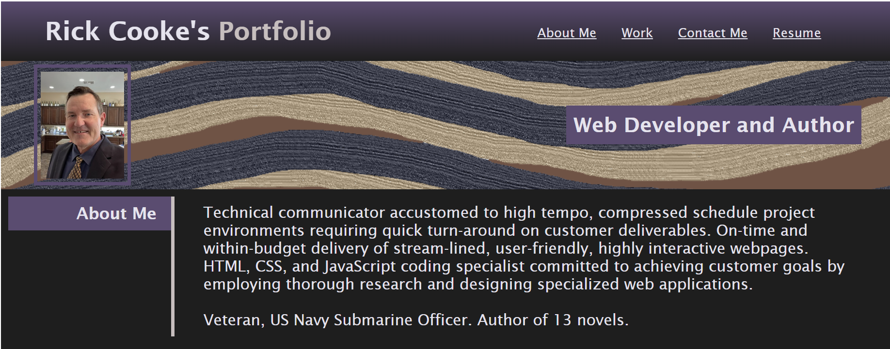
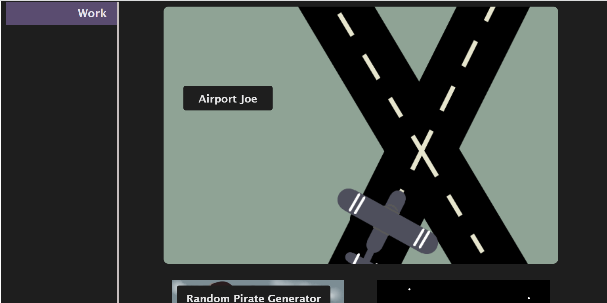
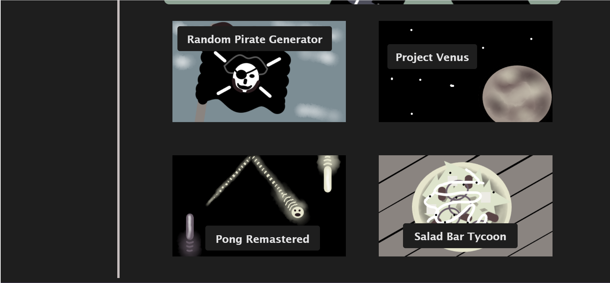
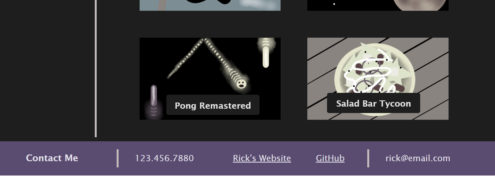

# Cooke-Portfolio-Project
# Challenge-02 - Advanced CSS Portfolio

## Description
The purpose of this project is to create a portfolio for my future projects that can be viewed by a potential employer.

### User Story

* AS AN employer
I WANT to view a potential employee's deployed portfolio of work samples
SO THAT I can review samples of their work and assess whether they're a good candidate for an open position

### Acceptance Criteria

> * GIVEN I need to sample a potential employee's previous work
> * WHEN I load their portfolio
> * THEN I am presented with the developer's name, a recent photo or avatar, and links to sections about them, their work, and how to contact them
> * WHEN I click one of the links in the navigation
> * THEN the UI scrolls to the corresponding section
> * WHEN I click on the link to the section about their work
> * THEN the UI scrolls to a section with titled images of the developer's applications
> * WHEN I am presented with the developer's first application
> * THEN that application's image should be larger in size than the others
> * WHEN I click on the images of the applications
> * THEN I am taken to that deployed application
> * WHEN I resize the page or view the site on various screens and devices
> * THEN I am presented with a responsive layout that adapts to my viewport

## Installation

> * To launch the webpage, open the browser and paste the following URL in the address bar: https://recenasu.github.io/Cooke-Portfolio-Project/
> * To access the project repo, open the browser and paste the following URL in the address bar: https://github.com/recenasu/Cooke-Portfolio-Project

## Usage

From the webpage navigation bar in the upper right, click on the desired topic, or scroll down.

The following images show the top, middle, and bottom of the webpage.

## Credits

N/A

## License

N/A

## Features

The webpage links function, but they currently point to placeholder webpages, due to my project portfolio being empty at the moment.

## Tests

>1. Open the "Cooke-Portfolio-Project" repo using VSCode
>2. Inspect the "index.html" and "style.css" files to confirm all items in the "Acceptance Criteria" section of this README have been implemented
